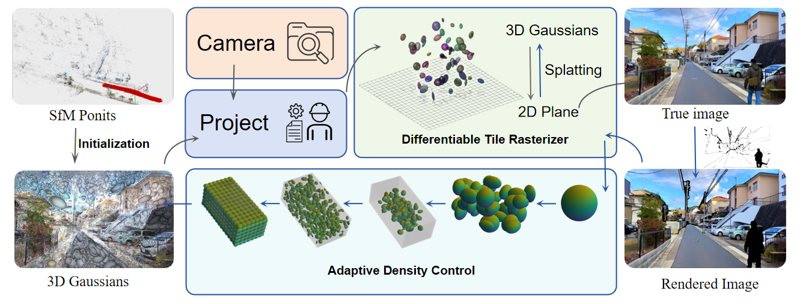

<div align="center">

  <h1 align="center">High-Fidelity Street Scene Reconstruction with Dynamic Object Elimination via 3D Gaussian Splatting</h1>
  <h2 align="center">ICML 2024</h2>

### [Paper]() | [web](https://deepcox.com/3dgs)

<table>
  <tr>
    <td align="center">
      
    </td>
    <td align="center">
      
    </td>
    <td align="center">
      
    </td>
    <td align="center">
      
    </td>
  </tr>
  <tr>
    <td align="center">
      
    </td>
    <td align="center">
      
    </td>
    <td align="center">
      
    </td>
    <td align="center">
      
    </td>
  </tr>
</table>

<div align="left">

## 📖 Abstract
<p align="justify">


This paper presents a novel approach for high-fidelity reconstruction of dynamic street scenes centered on human activities. To overcome the limitations of traditional methods in modeling moving objects and adapting to environmental changes, we introduce a 3D Gaussian point distribution technique combined with an adaptive transparency optimization mechanism. This method efficiently separates dynamic objects, enhancing scene accuracy while optimizing rendering efficiency through a progressive framework. Additionally, we propose an efficient encoding and storage mechanism for Gaussian points, reducing redundancy and maintaining geometric integrity in large-scale scenes. Experimental results demonstrate superior reconstruction accuracy and rendering efficiency performance compared to conventional techniques. The proposed method has broad applications in autonomous driving, high-precision mapping, virtual/augmented reality, and smart city development.
</p>
</div>

<div align="left">

## 🗓️ News

<p>[2024.10.10] Many thanks to <a href="https://github.com/wei872">Longfei Wei</a>, Improvements made to the code</p>

<p>[2024.10.10] Many thanks to <a href="https://github.com/kcheng1021/GaussianPro">GaussianPro</a>, Provide code for the project</p>

<p>Some amazing enhancements will also come out this year.</p>

</div>


<div align="left">

## 🗓️ TODO

- [✔] Code pre-release -- Beta version. 
- [✔] Demo Scenes.
- [✔] <strong>Pybinding & CUDA acceleration</strong>.
- [ ] Support for unordered set of images.

</div>

<strong>Some amazing enhancements are under development. We are warmly welcome anyone to collaborate in improving this repository. Please send me an email if you are interested!</strong>


<div align="left">

## 🚀 Pipeline


</div>


<div align="left">

## 🚀 Setup

#### Tested Environment
window 11, GeForce 4070, CUDA 12.1 (tested), C++17

#### Clone the repo.
```
git clone https://github.com/deepcoxcom/3DGS.git --recursive
```

#### Environment setup 
```
conda env create --file environment.yml

pip install ./submodules/Propagation_SSIM

# Don't forget to modify the mask location before running the code. cameras.py 54

python train.py -s data/streeview --eval
python train.py -s data/peoplecarstreeview --eval

```
</div>

<div align="left">

#### Original data source:

<p><a href="https://youtu.be/qv7L0rXFrXk?t=806">Nagoya</a>         <a href="https://www.bilibili.com/video/BV1ij28YqEe8/?spm_id_from=333.337.search-card.all.click&vd_source=c934243e4a837c01c8cd738bde266489&t=73">Quebec</a></p>

</div>

<div align="left">
# Public dataset link:

```
# Nagoya:
https://drive.google.com/drive/my-drive/streeview

# Quebec:
https://drive.google.com/drive/my-drive/peoplecarstreeview

```

</div>

<div align="left">
# Run the codes: 

```
# The detailed parameter configuration can be found in the paper section.

```
</div>

<div align="left">

#### Try your scenes:

```
**If you want to try your scenes, make sure your images are sorted in the time order, i.e. video data. The current version does not support unordered image sets. Then you can try the commands in demo.sh to run your own scenes.**

**Please ensure that your neighboring images have sufficient overlap.**

```
</div>

<div align="left">

## 🎫 Acknowledgment

This project largely references [3D Gaussian Splatting](https://github.com/graphdeco-inria/gaussian-splatting) and [ACMH/ACMM](https://github.com/GhiXu/ACMH). Thanks for their amazing works!

</div>

